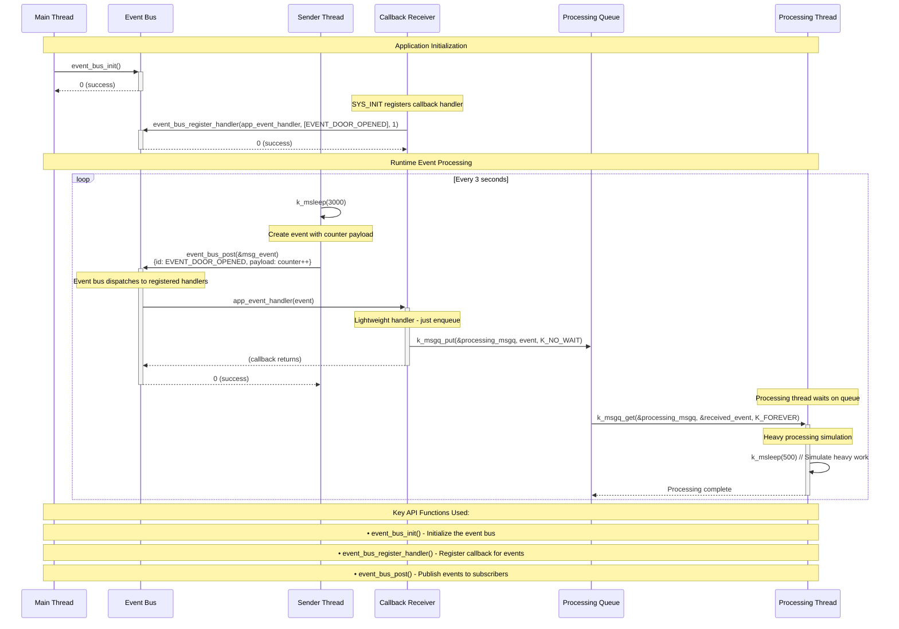

# Event Bus API Usage Sequence Diagram

This sequence diagram shows how the `app_event_bus` application uses the event bus API with the callback mechanism enabled.

## Analysis Summary

The `app_event_bus` application demonstrates the **callback-based** event bus pattern with the following key components:

### Core API Usage:

1. **Initialization**: `event_bus_init()` called once during startup
2. **Registration**: `event_bus_register_handler()` registers callbacks for specific event types
3. **Publishing**: `event_bus_post()` sends events to all registered handlers

### Architecture Pattern:

- **Sender Thread**: Periodically publishes `EVENT_DOOR_OPENED` events with incrementing counter
- **Callback Handler**: Lightweight, non-blocking handler that immediately enqueues events
- **Processing Thread**: Heavy processing happens asynchronously in dedicated thread
- **Message Queue**: Decouples event reception from processing to maintain responsiveness

### Key Benefits:

- **Decoupling**: Publishers don't know about subscribers
- **Responsiveness**: Callback handlers are kept lightweight
- **Scalability**: Heavy processing moved to separate threads
- **Thread Safety**: Uses Zephyr message queues for thread-safe communication

### Configuration:

The application can be configured to use either:
- **Callback mode** (current): `CONFIG_EVENT_BUS_USE_CALLBACK=y`
- **Polling mode**: `CONFIG_EVENT_BUS_USE_POLLING=y`
