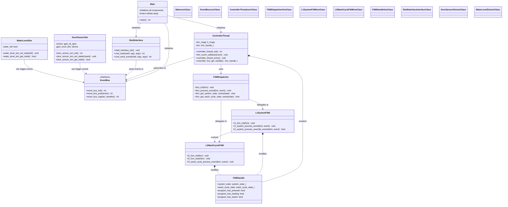
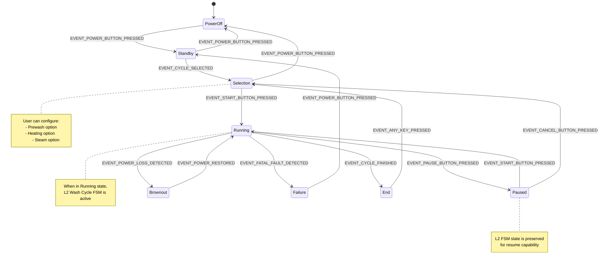
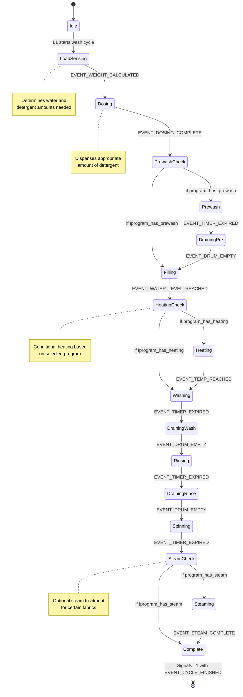
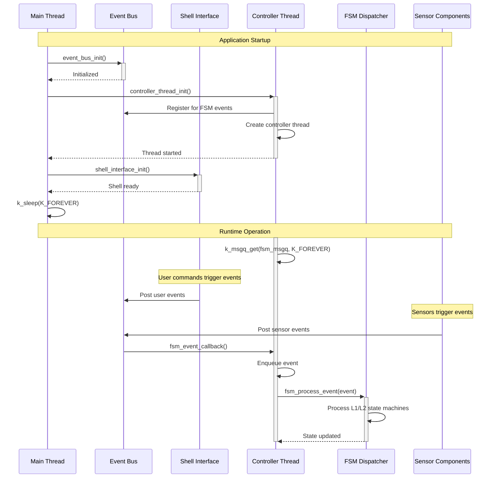
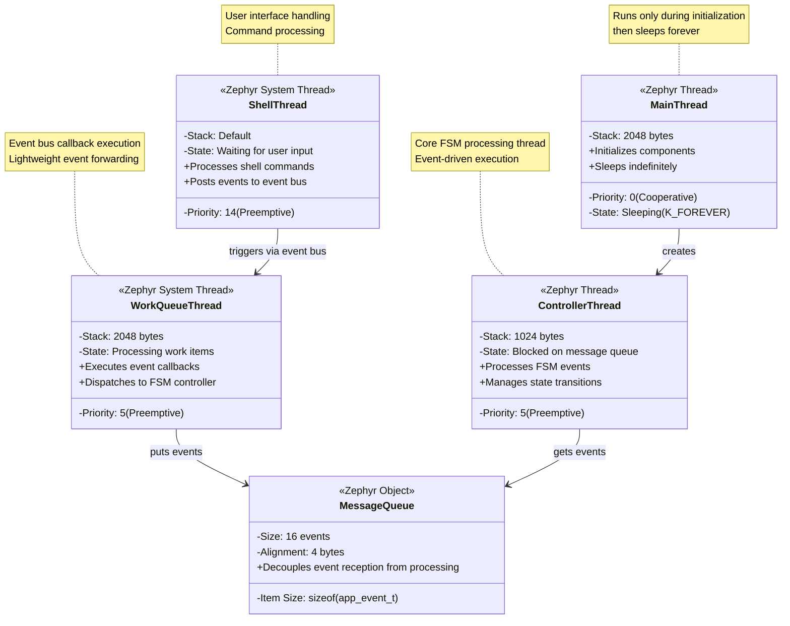
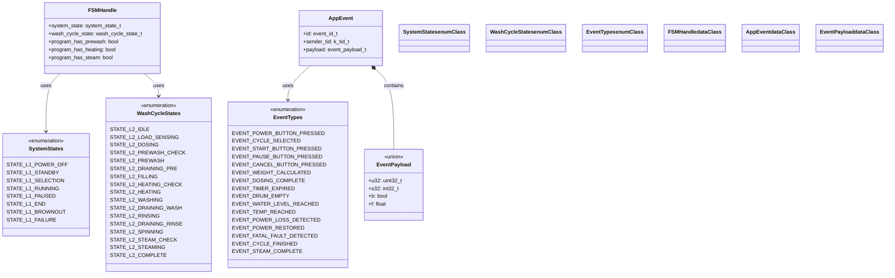
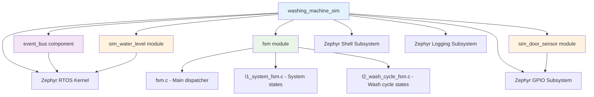

# Washing Machine Simulation - Design Document

## Overview

The Washing Machine Simulation is a Zephyr RTOS application that models the behavior of a smart washing machine using hierarchical finite state machines (FSMs). The application demonstrates real-time embedded system design patterns including event-driven architecture, state management, and sensor simulation.

## System Architecture

### High-Level Component View



## State Machine Design

### Level 1 System FSM (High-Level Control)



### Level 2 Wash Cycle FSM (Detailed Process Control)



## Dynamic Behavior

### Event Flow Sequence

```mermaid
sequenceDiagram
    participant User as User (Shell)
    participant Shell as Shell Interface
    participant EventBus as Event Bus
    participant Controller as Controller Thread
    participant L1FSM as L1 System FSM
    participant L2FSM as L2 Wash Cycle FSM
    participant Sensors as Sensor Simulators
    
    Note over User, Sensors: System Initialization
    Controller->>+EventBus: event_bus_register_handler(fsm_events[])
    EventBus-->>-Controller: Registration successful
    
    Note over User, Sensors: User Interaction Flow
    User->>Shell: send_event 4 (POWER_BUTTON_PRESSED)
    Shell->>+EventBus: event_bus_post(EVENT_POWER_BUTTON_PRESSED)
    EventBus->>Controller: fsm_event_callback(event)
    Controller->>Controller: k_msgq_put(fsm_msgq, event)
    EventBus-->>-Shell: Event posted
    
    Controller->>+L1FSM: l1_system_process_event(POWER_BUTTON_PRESSED)
    L1FSM->>L1FSM: STATE_L1_POWER_OFF → STATE_L1_STANDBY
    L1FSM-->>-Controller: State changed
    
    User->>Shell: send_event 7 (CYCLE_SELECTED)
    Shell->>+EventBus: event_bus_post(EVENT_CYCLE_SELECTED)
    EventBus->>Controller: fsm_event_callback(event)
    EventBus-->>-Shell: Event posted
    
    Controller->>+L1FSM: l1_system_process_event(CYCLE_SELECTED)
    L1FSM->>L1FSM: STATE_L1_STANDBY → STATE_L1_SELECTION
    L1FSM-->>-Controller: State changed
    
    User->>Shell: start (START_BUTTON_PRESSED)
    Shell->>+EventBus: event_bus_post(EVENT_START_BUTTON_PRESSED)
    EventBus->>Controller: fsm_event_callback(event)
    EventBus-->>-Shell: Event posted
    
    Controller->>+L1FSM: l1_system_process_event(START_BUTTON_PRESSED)
    L1FSM->>L1FSM: STATE_L1_SELECTION → STATE_L1_RUNNING
    L1FSM->>+L2FSM: l2_fsm_start(fsm)
    L2FSM->>L2FSM: STATE_L2_IDLE → STATE_L2_LOAD_SENSING
    L2FSM-->>-L1FSM: L2 FSM started
    L1FSM-->>-Controller: State changed
    
    Note over User, Sensors: Wash Cycle Processing
    loop Wash Cycle Events
        Sensors->>+EventBus: event_bus_post(sensor_event)
        EventBus->>Controller: fsm_event_callback(event)
        EventBus-->>-Sensors: Event posted
        
        Controller->>+L2FSM: l2_wash_cycle_process_event(sensor_event)
        L2FSM->>L2FSM: Process wash cycle transition
        
        alt Cycle Complete
            L2FSM->>L2FSM: → STATE_L2_COMPLETE
            L2FSM-->>-Controller: Cycle finished
            Controller->>+L1FSM: l1_system_process_event(EVENT_CYCLE_FINISHED)
            L1FSM->>L1FSM: STATE_L1_RUNNING → STATE_L1_END
            L1FSM-->>-Controller: System in end state
        else Continue Processing
            L2FSM-->>-Controller: Continue cycle
        end
    end
```

### Component Interaction Pattern



## Threading Model

### Thread Architecture



## Data Structures

### Core Data Types



## Configuration and Build

### Project Configuration (`prj.conf`)

The application uses these key Zephyr configurations:

- **Shell Support**: `CONFIG_SHELL=y` for interactive debugging
- **Logging**: `CONFIG_LOG=y` with immediate mode for real-time debugging  
- **GPIO Emulation**: `CONFIG_GPIO_EMUL=y` for sensor simulation
- **Serial Console**: `CONFIG_UART_CONSOLE=y` for user interaction
- **Main Stack**: `CONFIG_MAIN_STACK_SIZE=2048` for adequate stack space

### Build Dependencies



## Error Handling and Safety

### Error Conditions

1. **Event Bus Initialization Failure**
   - Cause: System resource exhaustion
   - Response: Application terminates with error code 1
   - Recovery: Manual system restart required

2. **Controller Thread Initialization Failure**  
   - Cause: Thread creation or event registration failure
   - Response: Application terminates with error code 1
   - Recovery: Check system resources and restart

3. **Message Queue Overflow**
   - Cause: Events arriving faster than FSM can process
   - Response: Warning logged, event dropped
   - Recovery: Automatic - system continues with reduced performance

4. **Invalid Shell Commands**
   - Cause: User enters invalid event ID or malformed command
   - Response: Error message displayed to user
   - Recovery: Automatic - shell remains responsive

### Safety Features

1. **Hierarchical Override Events**: Critical events (power loss, faults) can interrupt any state
2. **State Validation**: FSM ensures only valid state transitions occur
3. **Event Validation**: Shell interface validates event IDs before posting
4. **Resource Management**: Fixed-size message queues prevent memory exhaustion
5. **Graceful Degradation**: System continues operation even with dropped events

## Testing and Simulation

### Sensor Simulation

The application includes simulated sensor components for testing:

1. **Door Sensor Simulation**
   - GPIO-based simulation using Zephyr GPIO emulation
   - Can simulate door open/close events
   - Integrated with device tree for hardware abstraction

2. **Water Level Simulation**
   - Simple boolean state simulation  
   - Can simulate empty/full water tank states
   - Provides API for test automation

### Interactive Testing

The shell interface provides commands for manual testing:

- `start`: Posts START_BUTTON_PRESSED event
- `send_event <id>`: Posts any event by ID number
- Built-in Zephyr shell commands for system inspection

### Automated Testing

The FSM components include unit test suites:

- `test_fsm_dispatcher.c`: Tests main FSM dispatcher logic
- `test_l1_system_fsm.c`: Tests L1 system state machine
- `test_l2_wash_cycle_fsm.c`: Tests L2 wash cycle state machine

## Performance Characteristics

### Memory Usage

- **Static RAM**: ~4KB for thread stacks and static data structures
- **Dynamic RAM**: ~1KB for message queues and event buffers  
- **Flash**: ~16KB for application code and FSM logic

### Timing Characteristics

- **Event Processing Latency**: < 1ms (callback to FSM processing)
- **State Transition Time**: < 100μs (FSM state update)
- **Shell Response Time**: < 10ms (command to event posting)
- **Maximum Event Rate**: ~1000 events/second (limited by message queue)

### Resource Limits

- **Maximum Queued Events**: 16 (configurable)
- **Maximum Concurrent Threads**: 4 (main, controller, work queue, shell)
- **Maximum FSM States**: 8 L1 states, 17 L2 states
- **Maximum Event Types**: ~40 (defined in event_defs.h)

## Future Enhancements

### Planned Features

1. **Enhanced Sensor Integration**
   - Temperature sensor simulation
   - Vibration/unbalance detection
   - Door lock mechanism control

2. **Advanced Wash Programs**
   - Delicate fabric cycles
   - Quick wash options
   - Eco-friendly modes

3. **Remote Connectivity**
   - WiFi/Bluetooth connectivity simulation
   - Mobile app integration
   - Remote monitoring and control

4. **Fault Diagnosis**
   - Self-diagnostic routines
   - Error code reporting
   - Maintenance scheduling

### Architectural Improvements

1. **Persistent Configuration**
   - User preferences storage
   - Cycle history logging
   - Settings backup/restore

2. **Real-time Analytics**
   - Cycle efficiency monitoring
   - Energy consumption tracking
   - Usage pattern analysis

3. **Advanced Safety Features**
   - Child safety locks
   - Leak detection
   - Emergency stop procedures

This design document provides a comprehensive overview of the washing machine simulation application, covering both the static architecture and dynamic behavior of the system. The hierarchical FSM design demonstrates advanced embedded system patterns while maintaining clarity and testability.
