# Event Bus Design Document

## Overview

The Event Bus is a decoupled communication component for Zephyr RTOS applications that provides publish-subscribe messaging between threads and system components. It supports two operational modes: callback-based and polling-based event delivery.

## Design Goals

- **Decoupling**: Publishers and subscribers don't need direct references to each other
- **Thread Safety**: Safe communication across multiple threads
- **Configurability**: Support both callback and polling mechanisms
- **Performance**: Lightweight event delivery with minimal overhead
- **Scalability**: Support multiple publishers and subscribers

## Static View (Architecture)

### Component Structure

```mermaid
classDiagram
    class EventBus {
        <<interface>>
        +event_bus_init() int
        +event_bus_post(event) int
    }
    
    class EventTypes {
        <<enumeration>>
        EVENT_DOOR_OPENED
        EVENT_DOOR_CLOSED
        EVENT_APP_MESSAGE_SENT
        EVENT_CYCLE_FINISHED
        EVENT_TIMER_EXPIRED
        +EVENT_ID_COUNT
    }
    
    class AppEvent {
        +event_id_t id
        +k_tid_t sender_tid
        +event_payload_t payload
    }
    
    class EventPayload {
        <<union>>
        +uint32_t u32
        +int32_t s32
        +bool b
        +float f
    }
    
    namespace CallbackMode {
        class CallbackEventBus {
            -handler_subscription_t subscriptions[MAX_EVENT_HANDLERS]
            -int handler_count
            -struct k_work_q event_callback_q
            -K_MEM_SLAB work_item_slab
            +event_bus_register_handler(handler, events[], num_events) int
        }
        
        class EventHandler {
            <<interface>>
            +handle_event(event) void
        }
        
        class WorkItem {
            +struct k_work work
            +event_handler_t handler
            +app_event_t event
        }
        
        class HandlerSubscription {
            +event_handler_t handler
            +event_id_t subscribed_events[MAX_EVENTS_PER_HANDLER]
            +size_t num_events
        }
    }
    
    namespace PollingMode {
        class PollingEventBus {
            -subscription_t subscription_pool[MAX_SUBSCRIPTIONS]
            -K_MSGQ central_event_q
            -k_tid_t dispatcher_tid
            -K_MUTEX subscription_mutex
            +event_bus_subscribe(msgq, events[], num_events) event_subscription_t*
            +event_bus_unsubscribe(subscription) int
        }
        
        class EventSubscription {
            +bool is_used
            +struct k_msgq* subscriber_msgq
            +event_id_t subscribed_events[MAX_EVENTS_PER_SUBSCRIPTION]
            +size_t num_events
        }
        
        class DispatcherThread {
            +event_dispatcher_thread() void
        }
    }
    
    %% Relationships
    EventBus <|.. CallbackEventBus : implements
    EventBus <|.. PollingEventBus : implements
    
    AppEvent *-- EventPayload : contains
    AppEvent --> EventTypes : uses
    
    CallbackEventBus *-- HandlerSubscription : manages
    CallbackEventBus *-- WorkItem : creates
    CallbackEventBus --> EventHandler : invokes
    HandlerSubscription --> EventHandler : references
    
    PollingEventBus *-- EventSubscription : manages
    PollingEventBus *-- DispatcherThread : contains
    EventSubscription --> "1" k_msgq : targets
    
    %% Styling
    classDef interfaceClass fill:#e1f5fe,stroke:#01579b,stroke-width:2px
    classDef enumClass fill:#f3e5f5,stroke:#4a148c,stroke-width:2px
    classDef dataClass fill:#e8f5e8,stroke:#2e7d32,stroke-width:2px
    classDef callbackClass fill:#fff3e0,stroke:#e65100,stroke-width:2px
    classDef pollingClass fill:#fce4ec,stroke:#880e4f,stroke-width:2px
    
    class EventBus interfaceClass
    class EventHandler interfaceClass
    class EventTypes enumClass
    class AppEvent dataClass
    class EventPayload dataClass
    class CallbackEventBus callbackClass
    class WorkItem callbackClass
    class HandlerSubscription callbackClass
    class PollingEventBus pollingClass
    class EventSubscription pollingClass
    class DispatcherThread pollingClass
```

### Key Components

#### Core Data Structures

- **`app_event_t`**: The fundamental event structure containing ID, sender thread ID, and payload
- **`event_payload_t`**: Union supporting different data types (int32, uint32, bool, float)
- **`event_id_t`**: Enumeration of all supported event types

#### Callback Mode Components

- **`CallbackEventBus`**: Main implementation using work queues for asynchronous callback execution
- **`HandlerSubscription`**: Manages callback function registrations and event filtering
- **`WorkItem`**: Work queue item that wraps event and handler for asynchronous execution

#### Polling Mode Components

- **`PollingEventBus`**: Implementation using message queues and a central dispatcher
- **`EventSubscription`**: Tracks subscriber message queues and event filters
- **`DispatcherThread`**: Central thread that forwards events to subscriber queues

## Dynamic View (Behavior)

### Callback Mode Sequence

```mermaid
sequenceDiagram
    participant Main as Main Thread
    participant EventBus as Event Bus (Callback)
    participant Sender as Publisher Thread
    participant WorkQueue as Work Queue
    participant Subscriber as Subscriber Handler
    participant ProcessingQ as Processing Queue
    participant ProcessingTh as Processing Thread
    
    Note over Main, ProcessingTh: Initialization Phase
    Main->>+EventBus: event_bus_init()
    EventBus->>WorkQueue: k_work_queue_start()
    EventBus-->>-Main: 0 (success)
    
    Note over Subscriber: Registration (SYS_INIT)
    Subscriber->>+EventBus: event_bus_register_handler(handler, [EVENT_DOOR_OPENED], 1)
    EventBus->>EventBus: Store in subscriptions[]
    EventBus-->>-Subscriber: 0 (success)
    
    Note over Main, ProcessingTh: Event Publishing & Processing
    loop Event Lifecycle
        Sender->>Sender: Create event
        Sender->>+EventBus: event_bus_post(&event)
        
        Note over EventBus: Find matching subscriptions
        EventBus->>EventBus: Check subscriptions for event ID
        
        Note over EventBus: Allocate work item
        EventBus->>WorkQueue: k_mem_slab_alloc(&work_item)
        EventBus->>WorkQueue: k_work_init(&work_item->work)
        EventBus->>WorkQueue: k_work_submit_to_queue()
        EventBus-->>-Sender: 0 (success)
        
        Note over WorkQueue: Asynchronous execution
        WorkQueue->>+Subscriber: event_work_handler() → handler(event)
        
        Note over Subscriber: Lightweight processing
        Subscriber->>ProcessingQ: k_msgq_put(event, K_NO_WAIT)
        Subscriber-->>-WorkQueue: (handler returns)
        
        WorkQueue->>WorkQueue: k_mem_slab_free(work_item)
        
        Note over ProcessingTh: Heavy processing
        ProcessingQ->>+ProcessingTh: k_msgq_get(event, K_FOREVER)
        ProcessingTh->>ProcessingTh: Perform heavy work
        ProcessingTh-->>-ProcessingQ: Processing complete
    end
```

### Polling Mode Sequence

### State Diagram

## Configuration

The event bus supports build-time configuration through Kconfig:

### Callback Mode (`CONFIG_EVENT_BUS_USE_CALLBACK=y`)
- **Advantages**: Memory efficient, no dedicated subscriber threads required
- **Use Case**: When subscribers can handle events quickly or defer heavy work
- **Requirements**: `CONFIG_SYSTEM_WORKQUEUE_STACK_SIZE=2048`

### Polling Mode (`CONFIG_EVENT_BUS_USE_POLLING=y`)
- **Advantages**: Predictable execution context, subscriber controls timing
- **Use Case**: When subscribers need dedicated processing time or context
- **Requirements**: Each subscriber needs its own thread

## Resource Usage

### Callback Mode
- **Memory**: 
  - Handler subscriptions: `MAX_EVENT_HANDLERS * sizeof(handler_subscription_t)`
  - Work items: `MAX_CONCURRENT_CALLBACKS * sizeof(event_work_item_t)`
  - Work queue stack: `WORK_QUEUE_STACK_SIZE` bytes
- **Threads**: 1 (work queue thread)

### Polling Mode
- **Memory**:
  - Subscriptions: `MAX_SUBSCRIPTIONS * sizeof(subscription_t)`
  - Central queue: `CENTRAL_QUEUE_CAPACITY * sizeof(app_event_t)`
  - Dispatcher stack: `DISPATCHER_STACK_SIZE` bytes
- **Threads**: 1 (dispatcher) + N (subscribers)

## Performance Characteristics

### Event Posting Latency
- **Callback Mode**: O(N) where N = number of subscribed handlers
- **Polling Mode**: O(1) - single message queue put

### Memory Access Patterns
- **Callback Mode**: Dynamic allocation from memory slab
- **Polling Mode**: Static allocation with mutex-protected access

### Thread Context
- **Callback Mode**: Handlers execute in work queue context
- **Polling Mode**: Handlers execute in subscriber thread context

## Error Handling

### Common Error Conditions
- **EINVAL**: Invalid parameters (null pointers, zero counts)
- **ENOMEM**: Resource exhaustion (handlers, subscriptions, work items)
- **ENOSYS**: No event bus mechanism configured

### Recovery Strategies
- Graceful degradation when resources are exhausted
- Event dropping with logging when queues are full
- Automatic cleanup of expired subscriptions

## Usage Guidelines

### When to Use Callback Mode
- Lightweight event processing
- Memory-constrained environments
- Fire-and-forget event patterns
- When deferring heavy work to dedicated threads

### When to Use Polling Mode
- Predictable execution timing required
- Long-running event processing
- Priority-based event handling
- When subscriber threads already exist

## Future Enhancements

- Priority-based event delivery
- Event filtering by payload content
- Dynamic subscription management
- Event tracing and debugging support
- Multiple event bus instances
